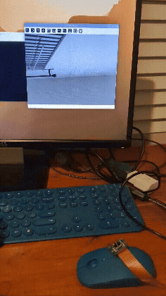
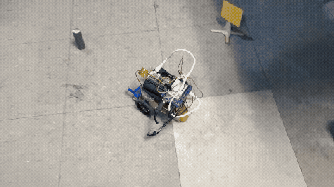

# Autonomous Boe-Bot OpenCV Vision System

This repository contains the software and testing documentation for a fully autonomous, 2-wheeled Boe-Bot rover that uses OpenCV.  Sparkbot, as the bot is known, is designed to identify targets that are a distinctive purple coloration, acquire them, and return them to a yellow home-flag.

## Hardware Stack
* **Microcontroller:** Arduino UNO with Prototype Shield
* **Vision Processing:** Raspberry Pi Zero W2
* **Chassis:** Boe-Bot 2-wheeled design

## System Architecture
* `src/pi_vision.py`: The Python script running on the Raspberry Pi. It uses OpenCV for object detection and visual processing.
* `arduino/final_collection_bot_code.ino`: The C++ controller logic that manages the motors and physical hardware based on serial data from the Pi.  IMPORTANT: For this code to run on your Arduino, you will need both the Servo and NewPing libraries installed locally.

## Project Testing & Final Run

**System Testing**

**Final Autonomous Run**

